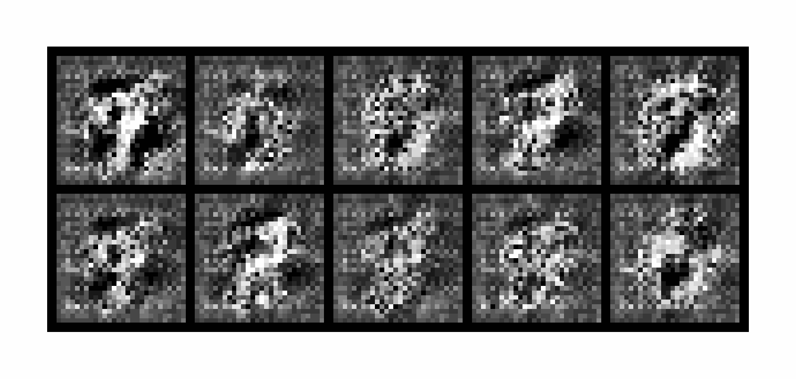

# Least squares GANs (LSGANs)

Original paper: [Least Squares Generative Adversarial Networks](https://arxiv.org/abs/1611.04076)

The goal is to solve the vanishing gradients problem which comes from the sigmoid cross entropy loss function.
This latter is replaced by the least squares function.

Two benefits of LSGANs:
- generate higher quality images than regular GANs
- more stabke learning process

Here is, the objective function of the classical GAN:

$$
V(D, G) = \mathbb{E}_{x \sim p_{\text{data}}}[\log D(x|y)] + \mathbb{E}_{z \sim p_z}[\log (1 - D(G(z|y)))]
$$

The proposed objective function of LSGAN:
```math
\min V_{\text{LSGAN}}(D) = \frac{1}{2} \mathbb{E}_{x \sim p_{\text{data}}}[(D(x)-b)^2] + \frac{1}{2} \mathbb{E}_{z \sim p_z}[(D(G(z))-a)^2]
```

```math
\min V_{\text{LSGAN}}(G) = \frac{1}{2} \mathbb{E}_{z \sim p_z}[(D(G(z))-c)^2]
```

- $a$: label for fake data
- $b$: label for real data
- $c$: the value that $G$ wants $D$ to believe for fake data

We can choose the parameters $a$, $b$ and $c$ such that we training $D$ and $G$ means minimizing the Pearson divergence.

## Results
This is the evolution of samples generated from a fixed noise vector after each epoch.


